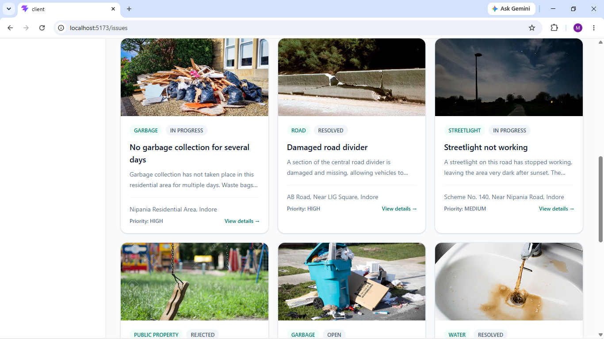
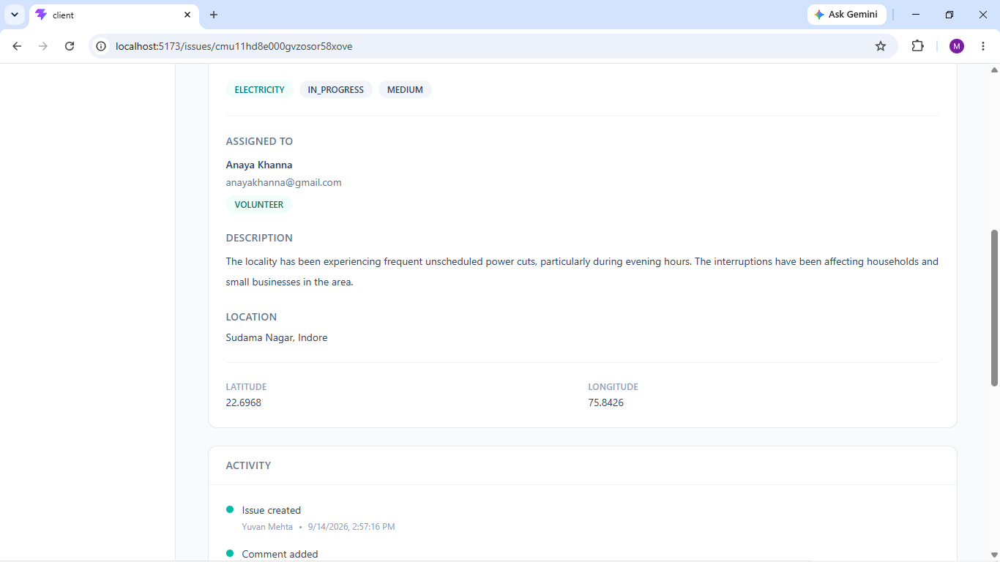
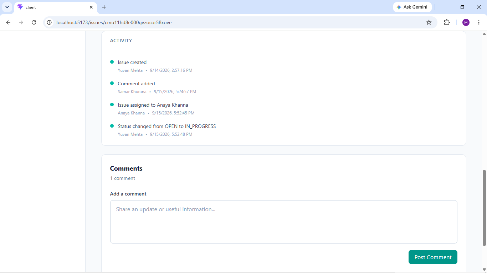

# CivicLens 🏙️

> **A role-based civic issue reporting and management platform that connects citizens with volunteers, authorities, and administrators to track public issues from reporting to resolution.**

CivicLens is a full-stack civic technology platform designed to make community issue reporting more structured, transparent, and actionable.

Instead of treating civic complaints as simple CRUD records, CivicLens models the complete issue lifecycle — from **citizen reporting and evidence upload to categorization, prioritization, assignment, status management, collaboration, activity tracking, and contribution analytics**.

The platform provides different workflows for **Citizens, Volunteers, Authorities, and Administrators**, with access controlled through role-based authorization.

---

## ✨ Why CivicLens?

Civic problems such as damaged roads, water leakage, garbage accumulation, broken streetlights, drainage issues, and damaged public property often require more than simply submitting a complaint.

CivicLens focuses on the workflow around an issue:

```text
Citizen Reports Issue
        ↓
Issue Categorized & Prioritized
        ↓
Evidence / Location Captured
        ↓
Authority / Admin Reviews
        ↓
Issue Assigned to Responsible Personnel
        ↓
Status Updated
        ↓
Community Collaboration & Activity Tracking
        ↓
Issue Resolved
```

This makes CivicLens a **workflow-oriented civic management system** rather than a basic complaint submission application.

---

## 🚀 Key Features

### 🔐 Authentication & Security

- User registration and login
- JWT-based authentication
- Protected API routes
- Token verification middleware
- Role-based access control (RBAC)
- Secure password hashing using `bcrypt`
- Profile management
- Input validation using `Zod`
- Centralized API error handling
- HTTP security headers using Helmet
- Configurable CORS
- HTTP response compression
- Request logging
- Environment-based configuration

---

### 👥 Role-Based Access Control

CivicLens supports four application roles:

| Role          | Responsibilities                                                                                                       |
| ------------- | ---------------------------------------------------------------------------------------------------------------------- |
| **CITIZEN**   | Report issues, track submitted reports, participate through comments, view contributions and reputation                |
| **VOLUNTEER** | Work with issues assigned to them and participate in the civic issue workflow                                          |
| **AUTHORITY** | Monitor civic issues, manage issue status, review assignments and oversee resolution                                   |
| **ADMIN**     | Full management capabilities including user creation, issue assignment, issue management and administrative operations |

Authorization is enforced at the API level rather than relying only on frontend visibility.

Example protected workflows include:

- Administrative user creation
- Issue assignment
- Issue status management
- Issue deletion
- Comment moderation
- Authenticated issue creation
- Authenticated contribution access

---

## 📊 Role-Specific Dashboards

CivicLens dynamically provides different dashboard experiences depending on the authenticated user's role.

### 👤 Citizen Dashboard

Citizens can view:

- Their reported issues
- Open issues
- Reputation score
- Recent community issues
- Contribution-related information
- Getting-started guidance

### 🏛️ Authority / Management Dashboard

Management users can monitor:

- Total issues
- Open issues
- In-progress issues
- Resolved issues
- High-priority issues
- Assigned issues
- Unassigned issues
- Resolution rate
- Issues assigned to themselves
- Issue management filters
- Issue sorting
- Issue assignment state

### 🤝 Volunteer Workspace

Volunteers receive a dedicated workflow showing:

- Issues assigned to them
- Assigned issue count
- Open assigned issues
- In-progress assigned issues
- Issue details and supporting information
- Workflow guidance

This role-specific architecture allows each user type to focus on the operations relevant to them.

---

# 🏙️ Civic Issue Management

CivicLens supports the complete lifecycle of a civic issue.

### Issue information

Each issue can contain:

- Title
- Detailed description
- Category
- Priority
- Address
- Latitude
- Longitude
- Evidence image
- Creator
- Assigned user
- Creation timestamp
- Last updated timestamp

### Issue Categories

```text
ROAD
WATER
ELECTRICITY
GARBAGE
STREETLIGHT
DRAINAGE
PUBLIC_PROPERTY
OTHER
```

### Issue Priority

```text
LOW
MEDIUM
HIGH
```

### Issue Status Lifecycle

```text
OPEN
  ↓
IN_PROGRESS
  ↓
RESOLVED
```

Issues can also be marked:

```text
REJECTED
```

This provides a structured representation of an issue's progress rather than storing a simple complaint record.

---

# 🔎 Search, Filtering & Pagination

The issue discovery interface supports:

### Search

Users can search civic issues by title.

### Filtering

Issues can be filtered by:

- Category
- Status

The management dashboard additionally supports:

- Priority
- Assignment state

### Sorting

Issue lists can be ordered by creation time.

### Pagination

The issue API supports paginated retrieval using:

```text
?page=1&limit=10
```

The frontend provides:

- Previous / Next navigation
- Page selection
- Current page information
- Search-aware filtering
- Filter reset

Search, filters and pagination are integrated into the issue browsing workflow rather than being purely cosmetic frontend controls.

---

# 🖼️ Evidence & Image Uploads

CivicLens allows citizens to attach photographic evidence when reporting an issue.

### Upload pipeline

```text
Frontend Form
     ↓
Multipart Form Data
     ↓
Multer
     ↓
Cloudinary
     ↓
Image URL
     ↓
PostgreSQL Issue Record
```

Supported image formats include:

- JPG
- JPEG
- PNG
- WebP

Maximum upload size:

```text
5 MB
```

Images are stored through **Cloudinary**, while the resulting image URL is associated with the issue record.

---

# 📍 Location-Aware Issue Data

Every issue stores:

```text
latitude
longitude
address
```

This allows CivicLens to retain structured geographic information with every civic report.

The current application captures and displays issue location information, while the architecture leaves room for future map-based visualization and geographic analytics.

---

# 💬 Community Comments

Users can participate in discussions around individual civic issues.

Supported operations include:

- Add comments
- View comments
- Edit own comments
- Delete own comments
- Administrative comment moderation

Comments are associated with both:

```text
User
  ↕
Comment
  ↕
Issue
```

This creates an issue-specific collaboration layer instead of keeping communication separate from the reported problem.

---

# 🕒 Activity Timeline

CivicLens maintains an activity history for issues.

Supported activity types include:

```text
ISSUE_CREATED
STATUS_UPDATED
COMMENT_ADDED
ISSUE_ASSIGNED
```

An issue can therefore maintain a chronological history of important actions.

Example:

```text
Issue created
      ↓
Comment added
      ↓
Issue assigned
      ↓
Status changed
      ↓
Comment added
      ↓
Issue resolved
```

This improves transparency and provides contextual history for an issue.

---

# 👷 Issue Assignment

Administrators can assign issues to:

- Volunteers
- Authorities

The assignment workflow includes:

1. Fetching eligible users
2. Selecting a volunteer/authority
3. Assigning the issue
4. Recording the assignment
5. Displaying the assigned user
6. Including the assignment in the issue workflow

Only valid `VOLUNTEER` and `AUTHORITY` users can be assigned through the backend service logic.

---

# ✏️ Issue Editing & Permissions

CivicLens applies ownership and lifecycle-based permissions.

Citizens can edit their own issues while the issue is:

```text
OPEN
```

Citizens can delete their own issues while the issue is:

```text
OPEN
```

Administrators have broader issue management permissions.

This means permissions are influenced by both:

```text
User Role
      +
Resource Ownership
      +
Issue State
```

rather than relying solely on whether a user is logged in.

---

# 👤 Profiles & Reputation

User profiles provide information such as:

- Name
- Email
- Role
- Reputation
- Verification state
- Account creation date
- Reported issues

The platform also maintains a reputation value for users, providing a foundation for future community engagement and trust mechanisms.

---

# 📈 Contribution Analytics

The Contributions section summarizes a user's civic activity.

It provides information such as:

- Total reported issues
- Resolved issues
- In-progress issues
- Open issues
- Rejected issues
- Issues grouped by category
- Daily activity

This transforms raw issue records and activity records into user-facing contribution insights.

---

# 🛡️ Backend Security & Validation

The backend includes multiple layers of protection.

### JWT Authentication

Authentication uses signed JWT tokens containing user identity and role information.

Protected requests use:

```http
Authorization: Bearer <token>
```

### Password Security

Passwords are hashed using:

```text
bcrypt
```

before being stored.

### RBAC Middleware

Authorization is implemented through reusable middleware:

```text
protect()
authorize(...)
```

This allows routes to explicitly define which roles may access sensitive operations.

### Request Validation

Incoming data is validated using `Zod`.

Examples include:

- Registration
- Login
- Profile updates
- Issue creation
- Issue updates
- Status changes
- Comments
- Management-user creation

### Security Middleware

The API also uses:

- Helmet
- CORS
- Compression
- Cookie parser
- Request logging
- Centralized error handling

---

# 🏗️ Architecture

CivicLens follows a modular full-stack architecture.

```text
                    ┌──────────────────────┐
                    │      React Client    │
                    │   TypeScript + Vite  │
                    └──────────┬───────────┘
                               │
                            Axios
                               │
                               ▼
                    ┌──────────────────────┐
                    │    Express REST API  │
                    │      TypeScript      │
                    └──────────┬───────────┘
                               │
                 ┌─────────────┼─────────────┐
                 │             │             │
                 ▼             ▼             ▼
              Auth/RBAC     Services     Validation
                 │             │             │
                 └─────────────┼─────────────┘
                               │
                         Prisma ORM
                               │
                               ▼
                    ┌──────────────────────┐
                    │     PostgreSQL       │
                    └──────────────────────┘

                               │
                               │ Image Uploads
                               ▼
                         ┌─────────────┐
                         │  Cloudinary │
                         └─────────────┘
```

---

# 🧩 Backend Architecture

The backend is organized into feature-oriented modules.

```text
server/src/
│
├── config/
│   ├── cloudinary.ts
│   └── prisma.ts
│
├── middlewares/
│   ├── auth.middleware.ts
│   └── upload.middleware.ts
│
├── modules/
│   ├── auth/
│   ├── issue/
│   ├── comment/
│   ├── activity/
│   ├── contribution/
│   └── users/
│
├── shared/
│   ├── errors/
│   ├── logger/
│   └── utils/
│
├── app.ts
└── server.ts
```

Most business modules follow a layered structure:

```text
Route
  ↓
Controller
  ↓
Service
  ↓
Repository
  ↓
Prisma
  ↓
PostgreSQL
```

This separation keeps HTTP handling, business logic and database access independently organized.

---

# 🗄️ Database Design

CivicLens uses **PostgreSQL** with **Prisma ORM**.

Core entities include:

```text
User
 │
 ├──────────────┐
 │              │
 ▼              ▼
Issue        Comment
 │
 ├───────────────┐
 │               │
 ▼               ▼
Activity      Assigned User
```

### Main models

#### User

Stores:

- Identity
- Authentication credentials
- Role
- Reputation
- Verification state
- Timestamps

#### Issue

Stores:

- Civic issue details
- Category
- Priority
- Status
- Location
- Image
- Creator
- Assignee
- Timestamps

#### Comment

Stores:

- Comment content
- Issue relationship
- User relationship
- Timestamps

#### Activity

Stores:

- Activity type
- Human-readable message
- Issue relationship
- User relationship
- Timestamp

The database also contains indexes for commonly queried relationships and issue attributes such as:

```text
createdById
assignedToId
status
category
issueId
userId
```

---

# 🔄 Prisma Migrations

Database changes are tracked through Prisma migrations rather than relying on an undocumented database state.

Current migration history includes migrations for:

```text
Initial schema
Issue model
Issue image support
Comment model
Activity timeline
Issue assignment
```

For production database deployment, migrations can be applied using:

```bash
npx prisma migrate deploy
```

---

# 🎨 Frontend Architecture

The frontend is built using:

- React
- TypeScript
- Vite
- React Router
- Tailwind CSS
- Axios

Main frontend areas include:

```text
client/src/
│
├── components/
├── context/
├── hooks/
├── layouts/
├── pages/
│   ├── auth/
│   ├── dashboard/
│   ├── issues/
│   ├── contributions/
│   └── profile/
│
├── routes/
├── services/
├── styles/
└── types/
```

API communication is centralized through an Axios client, which automatically attaches the stored JWT to authenticated requests.

---

# 🔐 Protected Frontend Routing

The frontend uses a protected route layer to prevent unauthenticated users from accessing the application workspace.

```text
User
 ↓
Authentication Check
 ↓
Authenticated?
 ├── No  → Login
 └── Yes → Application
```

Authentication state is maintained through a dedicated React context and authentication service.

---

# 📡 API Modules

The backend exposes REST endpoints grouped around application capabilities.

| Module                | Responsibility                                                             |
| --------------------- | -------------------------------------------------------------------------- |
| `/api/auth`           | Registration, login, current-user access and profile updates               |
| `/api/issues`         | Issue creation, listing, details, updates, status, assignment and deletion |
| `/api/comments`       | Comment management                                                         |
| `/api/contributions`  | User contribution analytics                                                |
| `/api/users`          | Administrative user management and assignable-user lookup                  |
| `/api/.../activities` | Issue activity timeline                                                    |

---

# 🧪 Validation & Error Handling

The application uses structured validation and centralized error handling.

Validation failures are handled separately from application-level errors.

The backend uses:

```text
Zod
  ↓
Validation
  ↓
Service Logic
  ↓
AppError / Error Handler
  ↓
Consistent API Response
```

Asynchronous controller operations are also wrapped using reusable async-handler utilities.

---

# ⚡ Performance & Production Middleware

The Express application includes:

### Compression

HTTP responses can be compressed before being transferred to clients, reducing response payload size and network overhead.

### Helmet

Adds commonly recommended HTTP security headers.

### CORS

Frontend/backend communication is configured through environment-based CORS settings.

### Logging

Request logging and application logging are supported using:

- Morgan
- Pino

This provides useful visibility during development and deployment.

---

# 📸 Screenshots

The repository contains a dedicated screenshot collection under:

```text
docs/screenshots/
```

### Login


### Citizen Dashboard


### Report an Issue


### Civic Issues




### Issue Details






### Contributions


### Profile


### Management Dashboard


### Volunteer Workspace


---

# 🛠️ Technology Stack

## Frontend

| Technology   | Purpose                        |
| ------------ | ------------------------------ |
| React        | UI development                 |
| TypeScript   | Type-safe frontend development |
| Vite         | Frontend build tooling         |
| React Router | Client-side routing            |
| Tailwind CSS | UI styling                     |
| Axios        | API communication              |

## Backend

| Technology  | Purpose                       |
| ----------- | ----------------------------- |
| Node.js     | Runtime                       |
| Express     | REST API framework            |
| TypeScript  | Type-safe backend development |
| Prisma      | ORM                           |
| PostgreSQL  | Relational database           |
| JWT         | Authentication                |
| bcrypt      | Password hashing              |
| Zod         | Request validation            |
| Multer      | Multipart file handling       |
| Cloudinary  | Image storage                 |
| Helmet      | HTTP security headers         |
| CORS        | Cross-origin configuration    |
| Compression | HTTP response compression     |
| Morgan      | HTTP request logging          |
| Pino        | Application logging           |

---

# 📁 Project Structure

```text
CivicLens/
│
├── client/
│   ├── src/
│   │   ├── components/
│   │   ├── context/
│   │   ├── hooks/
│   │   ├── layouts/
│   │   ├── pages/
│   │   ├── routes/
│   │   ├── services/
│   │   ├── styles/
│   │   └── types/
│   ├── .env.example
│   ├── package.json
│   └── vite.config.ts
│
├── server/
│   ├── prisma/
│   │   ├── migrations/
│   │   └── schema.prisma
│   │
│   ├── src/
│   │   ├── config/
│   │   ├── middlewares/
│   │   ├── modules/
│   │   ├── shared/
│   │   ├── app.ts
│   │   └── server.ts
│   │
│   ├── .env.example
│   └── package.json
│
├── docs/
│   └── screenshots/
│
├── .gitignore
├── package.json
└── README.md
```

---

# ⚙️ Local Development Setup

## Prerequisites

Install:

- Node.js
- npm
- PostgreSQL
- A Cloudinary account

---

## 1. Clone the repository

```bash
git clone https://github.com/manasvi-patidar/CivicLens.git
cd CivicLens
```

---

## 2. Install dependencies

From the project root:

```bash
npm ci
```

The repository uses npm workspaces for the frontend and backend packages.

---

## 3. Configure backend environment variables

Create:

```text
server/.env
```

using:

```text
server/.env.example
```

Example:

```env
PORT=5000

DATABASE_URL=your_postgresql_connection_string

JWT_SECRET=your_jwt_secret
JWT_EXPIRES_IN=7d

CLOUDINARY_CLOUD_NAME=your_cloudinary_cloud_name
CLOUDINARY_API_KEY=your_cloudinary_api_key
CLOUDINARY_API_SECRET=your_cloudinary_api_secret

CLIENT_URL=http://localhost:5173
```

Never commit real credentials or secret values.

---

## 4. Configure frontend environment variables

Create:

```text
client/.env
```

using:

```text
client/.env.example
```

Example:

```env
VITE_API_URL=http://localhost:5000/api
```

---

## 5. Generate Prisma Client

From the server directory:

```bash
cd server
npx prisma generate
```

---

## 6. Apply database migrations

For a local database:

```bash
npx prisma migrate dev
```

For an existing production database:

```bash
npx prisma migrate deploy
```

---

## 7. Start the backend

From:

```text
server/
```

run:

```bash
npm run dev
```

The API runs on:

```text
http://localhost:5000
```

Health check:

```text
http://localhost:5000/health
```

---

## 8. Start the frontend

Open another terminal:

```bash
cd client
npm run dev
```

The Vite development server will provide the frontend URL.

---

# 🧰 Available Scripts

## Root

```bash
npm ci
```

Installs workspace dependencies.

---

## Client

```bash
npm run dev
npm run build
npm run lint
npm run preview
```

---

## Server

```bash
npm run dev
npm run build
npm start
```

---

# 🏗️ Production Build Verification

Backend build:

```bash
cd server
npm run build
```

Frontend build:

```bash
cd client
npm run build
```

Production backend:

```bash
npm start
```

Before deployment, configure production environment variables and apply database migrations using:

```bash
npx prisma migrate deploy
```

---

# 🔮 Future Enhancements

The current architecture provides a strong foundation for extending CivicLens further.

Potential future improvements include:

- Interactive map-based issue visualization
- Geographic clustering and heatmaps
- Real-time issue updates
- Push/email notifications
- Advanced analytics dashboards
- Authority verification workflows
- Duplicate issue detection
- Community verification mechanisms
- Image-based issue classification
- AI-assisted issue categorization
- Predictive civic maintenance insights
- More advanced moderation and audit capabilities

These are future directions and are **not represented as currently implemented functionality**.

---

# 🎯 Engineering Highlights

CivicLens demonstrates several concepts relevant to real-world software engineering:

### Authentication

```text
JWT + bcrypt + protected routes
```

### Authorization

```text
RBAC + role-specific workflows
```

### Data Management

```text
PostgreSQL + Prisma + migrations
```

### API Design

```text
Express REST API
```

### Architecture

```text
Routes → Controllers → Services → Repositories → Prisma
```

### Validation

```text
Zod schemas
```

### File Handling

```text
Multer → Cloudinary
```

### Collaboration

```text
Comments + Activity Timeline
```

### Workflow Management

```text
Issue Status + Priority + Assignment
```

### User Engagement

```text
Reputation + Contributions + Activity
```

### Performance & Security

```text
Helmet + CORS + Compression + Logging
```

---

# 📌 Project Status

**CivicLens is a functional full-stack application with role-based workflows for citizens, volunteers, authorities, and administrators.**

The implemented application includes:

- Authentication
- Role-based access control
- Four user roles
- Role-specific dashboards
- Civic issue reporting
- Issue categorization
- Issue prioritization
- Issue lifecycle management
- Issue assignment
- Search
- Filtering
- Sorting
- Pagination
- Image uploads
- Location data
- Comments
- Activity timeline
- Contributions
- Reputation
- Profile management
- PostgreSQL persistence
- Prisma migrations
- API validation
- Security middleware
- Centralized error handling
- Logging

---

# 👨‍💻 Author

**Manasvi Patidar**

Full-stack application built with a focus on:

```text
Software Engineering
Backend Architecture
Database Design
Authentication & Authorization
Role-Based Systems
REST APIs
Full-Stack Development
```

---

## ⭐ If you find CivicLens interesting

CivicLens was built to explore how a civic reporting application can move beyond basic CRUD and implement **real-world workflows, role-based operations, issue ownership, assignment, collaboration, activity tracking, and analytics** in a full-stack system.
