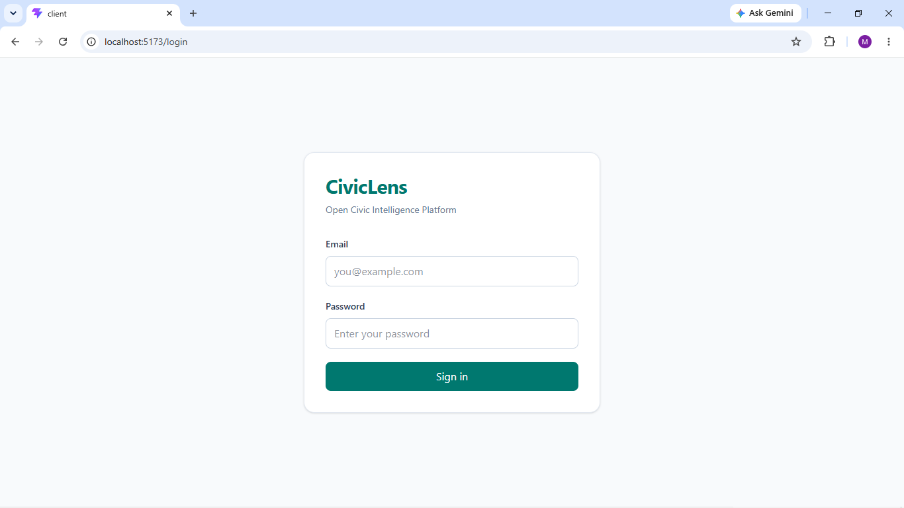
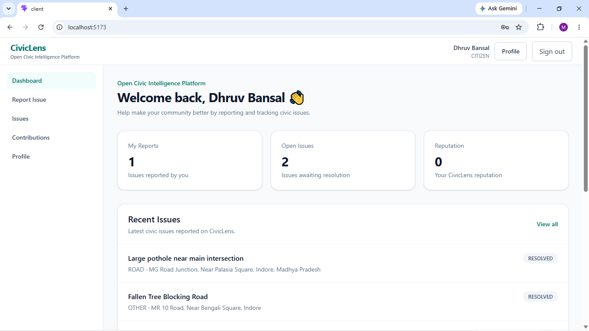
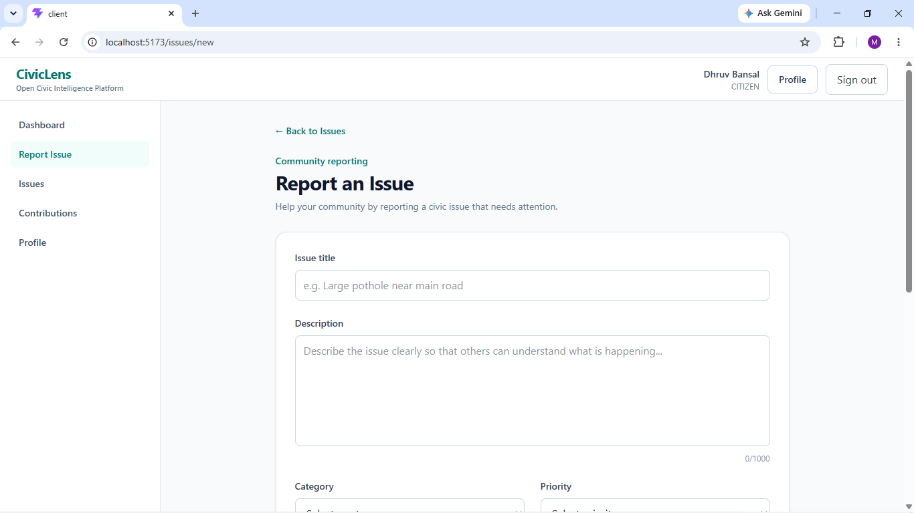
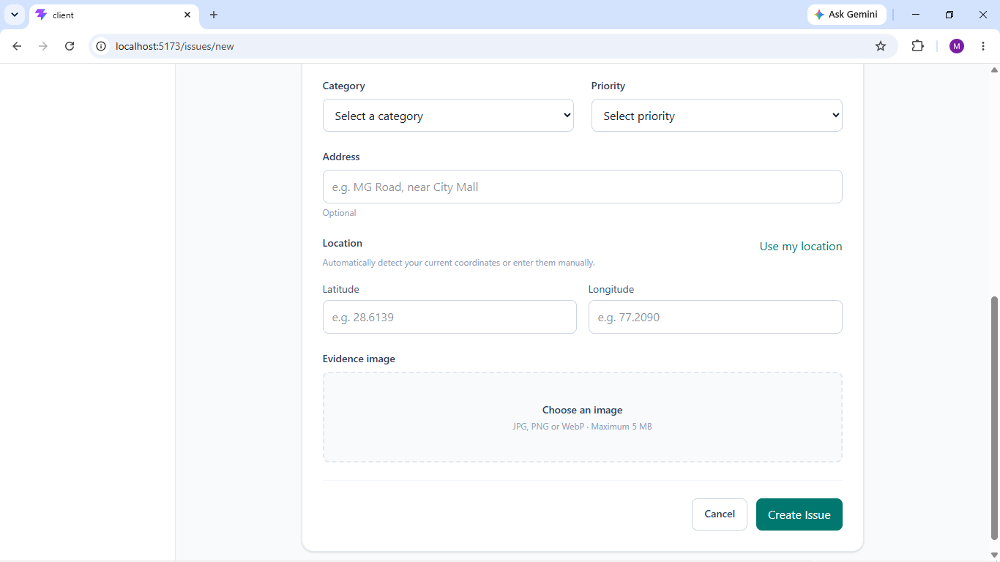
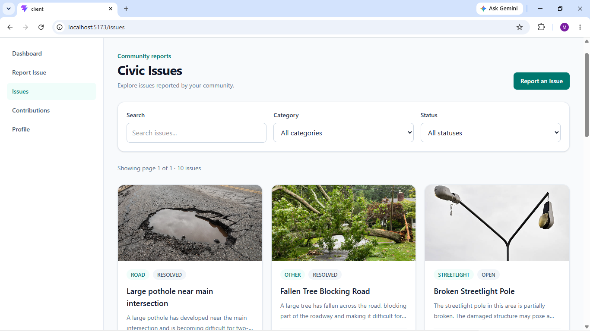
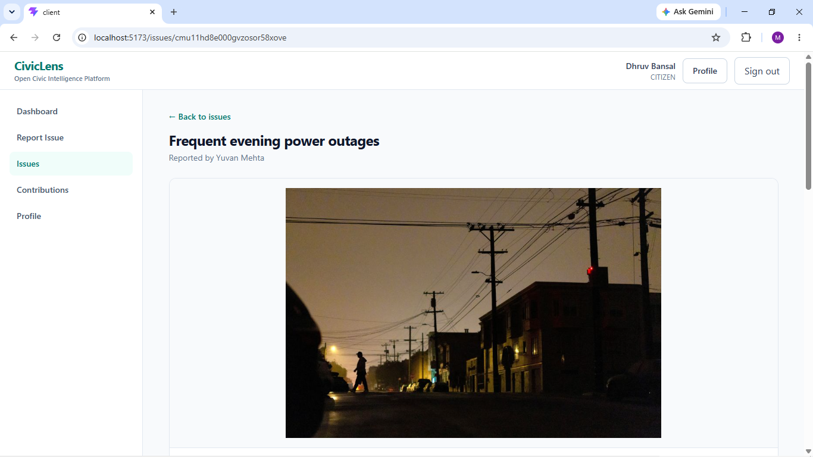
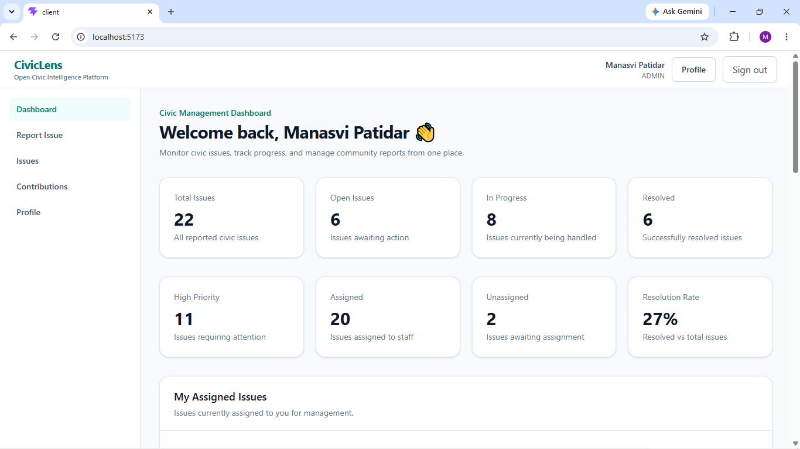
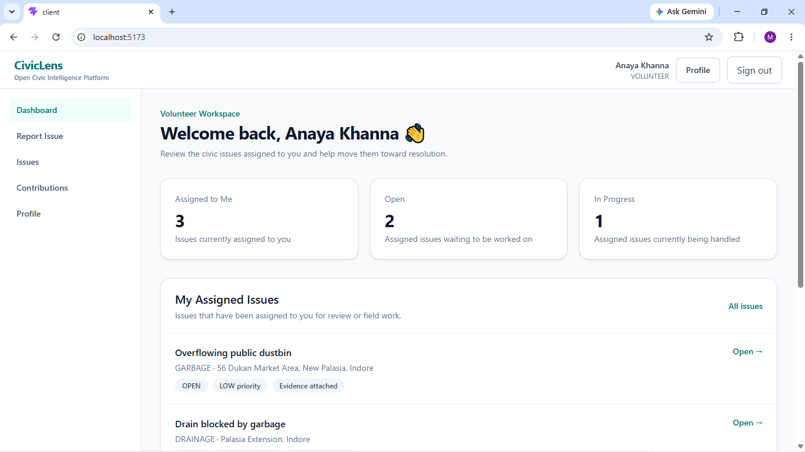
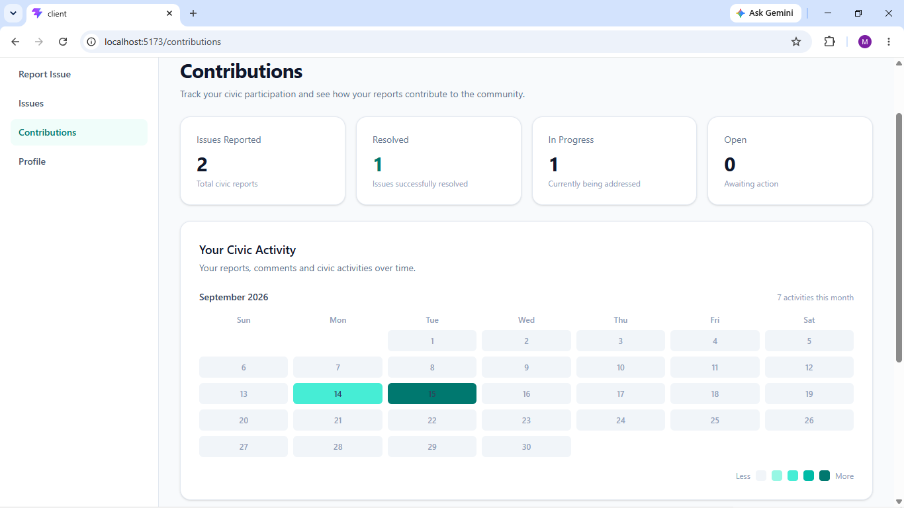
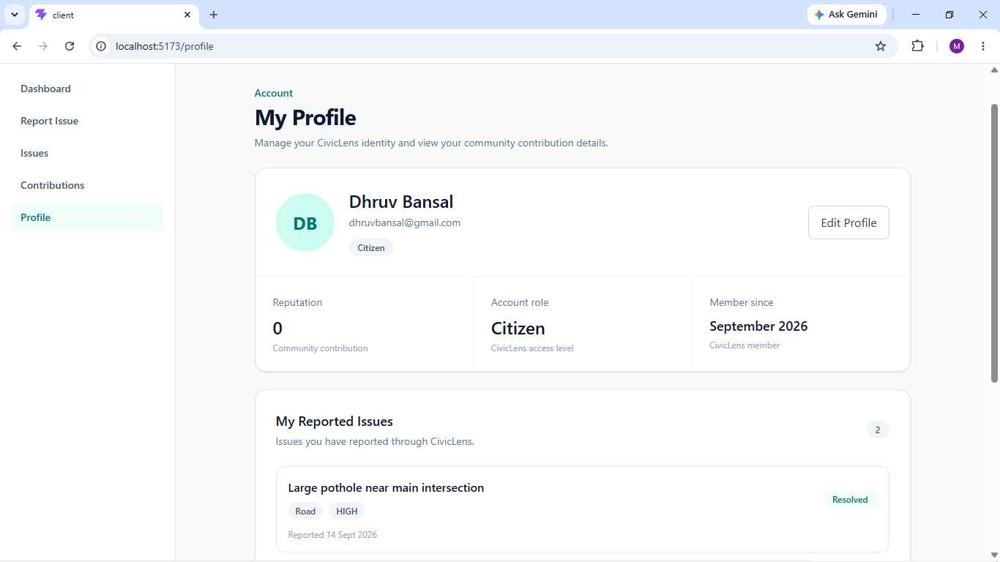

# 🏙️ CivicLens

### A Full-Stack Civic Issue Reporting & Management Platform

CivicLens is a full-stack web application designed to streamline the reporting, tracking, management, and monitoring of civic issues.

The platform connects **citizens, volunteers, authorities, and administrators** through a centralized system where civic issues can be reported, categorized, prioritized, assigned by authorized administrators, tracked through different statuses, discussed through comments, and monitored through an activity history.

Built with a modern **TypeScript-based full-stack architecture**, CivicLens combines a responsive React frontend, a structured Express backend, Prisma ORM, and PostgreSQL for civic issue management.

> **CivicLens — Report. Track. Collaborate. Resolve.**

## 📑 Table of Contents

- [Application Preview](#-application-preview)
- [Problem Statement](#-problem-statement)
- [Solution](#-solution)
- [Key Features](#-key-features)
- [User Roles & Permissions](#-user-roles--permissions)
- [Issue Lifecycle](#-issue-lifecycle)
- [Technology Stack](#️-technology-stack)
- [System Architecture](#️-system-architecture)
- [Project Structure](#-project-structure)
- [Getting Started](#-getting-started)
- [API Overview](#-api-overview)
- [Database Design](#️-database-design)
- [Security & Authentication](#-security--authentication)
- [Future Enhancements](#-future-enhancements)
- [Project Highlights](#-project-highlights)
- [Author](#️-author)

## 📸 Application Preview

CivicLens provides role-aware interfaces for different user roles and supports the civic issue workflow from reporting an issue through status tracking, collaboration, and resolution.

### 🔐 Authentication



### 👤 Citizen Dashboard



### 📝 Report a Civic Issue



### 📍 Issue Location



### 📋 Issues & Issue Details





### 📊 Management Dashboard



### 🤝 Volunteer Workspace



### 📈 Contributions & Activity



### 👤 User Profile



## 🎯 Problem Statement

Civic issues such as damaged roads, water-related problems, faulty streetlights, garbage accumulation, drainage issues, and damage to public infrastructure often require coordination between citizens and the authorities responsible for addressing them.

In a conventional reporting process, several challenges can arise:

- 📢 **Fragmented reporting** — Civic complaints may be reported through different channels, making centralized tracking difficult.
- 🔎 **Limited visibility** — Citizens may have little visibility into the current status of an issue after reporting it.
- 👥 **Coordination challenges** — Authorities and volunteers need a structured way to manage, assign, and work on reported issues.
- 📊 **Lack of structured information** — Issues can vary in category, priority, location, and status, making systematic management important.
- 📝 **Limited activity tracking** — Changes made to an issue need to be traceable throughout its lifecycle.

### The Need

A centralized platform can bring these interactions into a single system, providing structured issue reporting, role-specific access, assignment workflows, progress tracking, and transparent activity history.

**CivicLens was developed to address this need by providing a unified platform for reporting, managing, collaborating on, and tracking civic issues from submission through resolution.**

## 💡 Solution

**CivicLens** provides a centralized, role-based platform for managing civic issues throughout their lifecycle.

The application allows citizens to report issues with relevant information such as category, priority, description, images, and location. Once submitted, issues can be reviewed and managed by authorized users, assigned to appropriate personnel, updated as work progresses, and tracked through their resolution.

The platform is built around four distinct user roles:

- 👤 **Citizens** — Report civic issues, monitor their progress, and participate through comments.
- 🤝 **Volunteers** — Access issues assigned to them and participate through issue information, comments, and activity history.
- 🏛️ **Authorities** — Review and manage issues, update issue statuses, and participate in the issue workflow.
- 🛡️ **Administrators** — Perform administrative operations, manage users, assign issues, and perform higher-level issue management.

### 🔄 Centralized Issue Lifecycle

CivicLens structures the issue management process into a clear workflow:

**Report → Review → Assign → Work → Track → Resolve**

Each issue maintains its own status, priority, category, associated users, comments, and activity history, providing a structured record of how the issue progresses through the system.

### 🧩 Role-Based Experience

Instead of providing every user with the same interface, CivicLens presents functionality according to the user's role and permissions. This creates separate workflows for citizens, volunteers, authorities, and administrators while maintaining a shared underlying platform.

### 📌 From Report to Resolution

CivicLens brings together:

- Issue reporting
- Issue categorization and prioritization
- Image-based issue documentation
- Administrator-controlled issue assignment
- Status management
- User collaboration through comments
- Activity tracking
- Role-aware dashboards
- User and contribution management

This creates a single system where civic issues can be **reported, organized, assigned, monitored, and managed throughout their lifecycle**.

## ✨ Key Features

### 🔐 Secure Authentication & Role-Based Access

- JWT-based user authentication with secure password hashing.
- Role-based authorization for **Citizens, Volunteers, Authorities, and Administrators**.
- Protected frontend routes and backend authorization checks.

### 🏙️ Complete Civic Issue Management

- Report civic issues with **category, priority, description, location, and images**.
- Track issues through their lifecycle: **Open → In Progress → Resolved / Rejected**.
- View detailed issue information and current progress.

### 👥 Multi-Role Collaboration

### 👥 Multi-Role Collaboration

- Administrators can assign issues to Volunteers or Authorities.
- Volunteers can access issues assigned to them and participate through issue information, comments, and activity history.
- Authorities can manage issues and update their statuses.
- Citizens can monitor the issues they have reported and participate through comments.

### 📊 Role-Aware Dashboards

- Dashboard views adapt to the authenticated user's role.
- Different roles are provided with relevant issue information, statistics, activities, and workflows according to their permissions.

### 💬 Comments & Activity Tracking

- Users can collaborate through issue-level comments.
- Issue activity history records important actions and status changes, providing a chronological view of progress.

### ☁️ Image Upload & Cloud Storage

- Civic issues can include image evidence.
- Uploaded images are handled through cloud-based media storage rather than relying solely on local server storage.

### 🧩 Structured Full-Stack Architecture

- Type-safe **TypeScript** implementation across frontend and backend.
- Layered backend architecture separating **controllers, services, repositories, and database access**.
- **Prisma ORM + PostgreSQL** for structured and relational data management.

## 👥 User Roles & Permissions

CivicLens uses **Role-Based Access Control (RBAC)** to provide different capabilities and workflows to different types of users.

| Role             | Core Responsibilities                                                                                  |
| ---------------- | ------------------------------------------------------------------------------------------------------ |
| 👤 **Citizen**   | Report civic issues, view reported issues, track progress, and participate through comments.           |
| 🤝 **Volunteer** | Access issues assigned to them and participate through issue information, comments, and activity data. |
| 🏛️ **Authority** | Review and manage issues, update issue statuses, and participate in the resolution workflow.           |
| 🛡️ **Admin**     | Perform administrative operations, manage users, assign issues, and manage civic issues.               |

### 🔒 Access Control

Authorization is enforced at both the **frontend and backend levels**:

- Protected routes restrict access to authenticated users.
- Role-specific interfaces expose relevant functionality.
- Backend authorization prevents unauthorized operations even when API endpoints are accessed directly.
- User roles are persisted and managed through the application database.

This ensures that users can interact only with functionality permitted by their assigned role.

## 🔄 Issue Lifecycle

CivicLens follows a structured workflow for managing civic issues from initial reporting through their final outcome.

```text
┌───────────────┐
│    Citizen    │
│ Reports Issue │
└───────┬───────┘
        │
        ▼
┌───────────────┐
│     OPEN      │
└───────┬───────┘
        │
        ▼
┌───────────────┐
│  IN_PROGRESS  │
└───────┬───────┘
        │
        ├──────────────────┐
        ▼                  ▼
┌───────────────┐   ┌───────────────┐
│    RESOLVED   │   │    REJECTED   │
└───────────────┘   └───────────────┘
```

### Workflow Overview

1. **Report** — A citizen submits a civic issue with relevant details and supporting information.
2. **Open** — The newly reported issue enters the system as an open issue.
3. **Assignment & Work** — Administrators can assign issues to Volunteers or Authorities, after which authorized users can manage the issue and update its status.
4. **Resolution** — Once addressed, the issue can be marked as resolved.
5. **Rejection** — Issues that do not qualify or cannot be processed can follow the rejection path.
6. **Activity History** — Important changes throughout the issue lifecycle are recorded in the activity timeline.

## 🛠️ Technology Stack

CivicLens is built using a **TypeScript-based full-stack architecture**, with a React frontend, Express backend, Prisma ORM, and PostgreSQL database.

| Layer                    | Technologies                          |
| ------------------------ | ------------------------------------- |
| **Frontend**             | React, TypeScript, React Router, Vite |
| **Styling**              | Tailwind CSS                          |
| **Backend**              | Node.js, Express, TypeScript          |
| **API**                  | RESTful APIs                          |
| **ORM**                  | Prisma                                |
| **Database**             | PostgreSQL                            |
| **Authentication**       | JWT, bcrypt                           |
| **File & Image Storage** | Cloudinary                            |
| **Development**          | Git, GitHub                           |
| **Package Management**   | npm                                   |

### 🏗️ Architecture at a Glance

```text
React + TypeScript
        │
        │ REST API
        ▼
Node.js + Express + TypeScript
        │
        ▼
Controllers → Services → Repositories
        │
        ▼
      Prisma ORM
        │
        ▼
    PostgreSQL
```

Supporting services such as **JWT authentication** and **Cloudinary image storage** integrate into the application where required.

## 🏗️ System Architecture

CivicLens follows a layered full-stack architecture that separates the presentation layer, API layer, business logic, data-access logic, and persistence layer.

```text
                         ┌──────────────────────────┐
                         │       CivicLens User     │
                         │ Citizen / Volunteer /    │
                         │ Authority / Admin        │
                         └────────────┬─────────────┘
                                      │
                                      ▼
                         ┌──────────────────────────┐
                         │     React Frontend       │
                         │      TypeScript          │
                         │                          │
                         │ • UI Components          │
                         │ • Routing                │
                         │ • Auth Context           │
                         │ • Protected Routes       │
                         │ • API Services           │
                         └────────────┬─────────────┘
                                      │
                              HTTP / REST API
                                      │
                                      ▼
                         ┌──────────────────────────┐
                         │     Express Backend      │
                         │      TypeScript          │
                         │                          │
                         │ • Routes                 │
                         │ • Middleware             │
                         │ • Controllers            │
                         │ • Services               │
                         │ • Repositories           │
                         │ • Error Handling         │
                         └────────────┬─────────────┘
                                      │
                                      ▼
                         ┌──────────────────────────┐
                         │       Prisma ORM         │
                         │                          │
                         │ • Type-safe DB access    │
                         │ • Data modeling          │
                         │ • Query management       │
                         └────────────┬─────────────┘
                                      │
                                      ▼
                         ┌──────────────────────────┐
                         │       PostgreSQL         │
                         │                          │
                         │ Users • Issues           │
                         │ Comments • Activities    │
                         │ Relations                │
                         └──────────────────────────┘

             ┌────────────────────┐
             │     Cloudinary     │
             │   Image Storage    │
             └─────────▲──────────┘
                       │
                Image Uploads
```

### Architectural Flow

A typical CivicLens operation follows this flow:

```text
User Interaction
       ↓
React Component
       ↓
Frontend API Service
       ↓
Express Route
       ↓
Authentication / Authorization Middleware
       ↓
Controller
       ↓
Service Layer
       ↓
Repository Layer
       ↓
Prisma ORM
       ↓
PostgreSQL
```

This separation keeps responsibilities organized and makes the backend easier to maintain, test, and extend.

### Security & Access Control

Authentication and authorization are integrated into the request flow:

- **JWT tokens** are used to authenticate users.
- Protected backend routes validate authenticated requests.
- **Role-based authorization** restricts operations according to user roles.
- Passwords are securely hashed rather than stored as plain text.
- Sensitive configuration such as database credentials and authentication secrets is managed through environment variables.

## 📁 Project Structure

CivicLens is organized as a separate frontend and backend application, allowing each layer to evolve independently while communicating through REST APIs.

```text
CivicLens/
│
├── client/                              # React frontend
│   ├── public/                          # Static assets
│   ├── src/
│   │   ├── components/                  # Reusable UI components
│   │   │   └── layout/
│   │   ├── context/                     # Authentication/application context
│   │   ├── hooks/                       # Custom React hooks
│   │   ├── layouts/                     # Application layouts
│   │   ├── pages/                       # Application pages
│   │   │   ├── auth/
│   │   │   ├── contributions/
│   │   │   ├── dashboard/
│   │   │   ├── issues/
│   │   │   └── profile/
│   │   ├── routes/                      # Frontend route configuration
│   │   ├── services/                    # API communication
│   │   ├── styles/                      # Application styles
│   │   └── types/                       # TypeScript types
│   ├── package.json
│   └── README.md
│
├── server/                              # Express backend
│   ├── src/
│   │   ├── config/                      # Application configuration
│   │   ├── middlewares/                 # Authentication, authorization, validation, etc.
│   │   ├── modules/                     # Feature-based backend modules
│   │   │   ├── auth/
│   │   │   ├── users/
│   │   │   ├── issue/
│   │   │   ├── comment/
│   │   │   ├── activity/
│   │   │   └── contribution/
│   │   └── shared/                      # Shared errors, logging, and utilities
│   │       ├── errors/
│   │       ├── logger/
│   │       └── utils/
│   ├── prisma/
│   │   ├── migrations/                  # Prisma database migrations
│   │   └── schema.prisma                # Database schema
│   ├── package.json
│   └── README.md
│
├── docs/
│   └── screenshots/                     # Project screenshots
│
└── README.md                            # Project documentation
```

### 📦 Application Layers

| Layer / Component | Responsibility                                                           |
| ----------------- | ------------------------------------------------------------------------ |
| **Client**        | User interface, routing, state/context management, and API communication |
| **Routes**        | Define and organize API endpoints within backend feature modules         |
| **Middleware**    | Authentication, authorization, validation, and request processing        |
| **Controllers**   | Handle incoming requests and API responses                               |
| **Services**      | Implement application and business logic                                 |
| **Repositories**  | Encapsulate database access                                              |
| **Prisma**        | Type-safe ORM and database interaction                                   |
| **PostgreSQL**    | Persistent application data                                              |

The separation of concerns keeps the codebase modular and makes individual layers easier to maintain and extend.

## 🚀 Getting Started

### Prerequisites

- Node.js & npm
- PostgreSQL
- Git
- Cloudinary account

### Setup

```bash
git clone <YOUR_GITHUB_REPOSITORY_URL>
cd CivicLens

cd client && npm install
cd ../server && npm install
```

Create `.env` files in `client/` and `server/` using the provided `.env.example` files.

From `server/`:

```bash
npx prisma generate
npx prisma migrate deploy
npm run dev
```

From `client/`:

```bash
npm run dev
```

Open the Vite URL shown in the terminal, typically `http://localhost:5173`.

## 🔌 API Overview

CivicLens exposes a RESTful backend API for authentication, user management, civic issue management, comments, assignments, and activity tracking.

### API Base URL

```text
http://localhost:5000/api
```

### Core API Modules

| Module             | Purpose                                                  |
| ------------------ | -------------------------------------------------------- |
| **Authentication** | User registration, login, and authentication             |
| **Users**          | User profiles, roles, and administrative user management |
| **Issues**         | Create, view, update, assign, and manage civic issues    |
| **Comments**       | Add and manage issue-related discussions                 |
| **Activities**     | Track important issue actions and status changes         |

### Request Flow

```text
Client
  ↓
REST API
  ↓
Authentication & Authorization
  ↓
Controller
  ↓
Service
  ↓
Repository
  ↓
Prisma
  ↓
PostgreSQL
```

The API uses **JWT-based authentication** and **role-based authorization** to protect restricted operations.

## 🗄️ Database Design

CivicLens uses **PostgreSQL** as its relational database with **Prisma ORM** for type-safe database access and relationship management.

### Core Data Models

```text
┌──────────────┐
│     User     │
└──────┬───────┘
       │
       ├───────────────┐
       │               │
       ▼               ▼
┌──────────────┐  ┌──────────────┐
│    Issue     │  │   Comment    │
└──────┬───────┘  └──────────────┘
       │
       │
       ▼
┌──────────────┐
│   Activity   │
└──────────────┘

Issue
  │
  └── assignedToId ──► User
```

### Main Models

| Model        | Purpose                                                     |
| ------------ | ----------------------------------------------------------- |
| **User**     | Stores user accounts, roles, and profile information        |
| **Issue**    | Stores reported civic issues, assignment, and current state |
| **Comment**  | Stores discussions associated with issues                   |
| **Activity** | Maintains a chronological record of important issue actions |

### Issue Classification

Issues are structured using predefined:

- **Categories:** Road, Water, Electricity, Garbage, Streetlight, Drainage, Public Property, Other
- **Statuses:** Open, In Progress, Resolved, Rejected
- **Priorities:** Low, Medium, High

Prisma manages the relationships between these entities while PostgreSQL provides persistent relational storage.

## 🔒 Security & Authentication

CivicLens implements authentication and authorization mechanisms to protect user accounts, APIs, and role-specific operations.

### Authentication

- **JWT-based authentication** for secure user sessions.
- Passwords are stored using **secure hashing** with bcrypt.
- Protected API routes require valid authentication credentials.
- Authentication state is managed on the frontend through the application auth context.

### Authorization

- **Role-Based Access Control (RBAC)** is implemented for:
  - `CITIZEN`
  - `VOLUNTEER`
  - `AUTHORITY`
  - `ADMIN`

- Backend authorization checks ensure restricted operations cannot be performed by unauthorized roles.
- Frontend protected routes provide role-specific access to application features.

> 🔐 Security is enforced at the API layer rather than relying solely on frontend restrictions.

## 🔮 Future Enhancements

CivicLens provides a foundation that can be extended with additional features and intelligent capabilities.

Potential future enhancements include:

- 🗺️ **Interactive Issue Map** — Visualize reported civic issues geographically using latitude and longitude data.
- 🤖 **AI-Based Issue Classification** — Automatically categorize and prioritize issues using machine learning.
- 📈 **Predictive Analytics** — Identify recurring issue patterns and generate insights from historical civic data.
- 🔔 **Real-Time Notifications** — Notify users when an assigned issue or reported issue changes status.
- 📱 **Mobile Application** — Extend CivicLens to Android and iOS platforms.
- 📊 **Advanced Analytics Dashboard** — Provide deeper insights into issue trends, resolution rates, categories, and locations.
- 🧠 **Duplicate Issue Detection** — Identify potentially duplicate reports for the same civic problem.
- 🔍 **Advanced Search & Filtering** — Enable more detailed filtering based on location, category, priority, status, and time.
- 🌐 **Scalable Cloud Infrastructure** — Further optimize the platform for larger datasets and higher user traffic.

These enhancements can evolve CivicLens from a civic issue management platform into a more intelligent and data-driven civic technology solution.

## ⭐ Project Highlights

CivicLens was designed as a **functional full-stack application** rather than a basic CRUD demonstration.

### What Makes the Project Stand Out

- 🏗️ **Layered Backend Architecture** — Controllers, services, repositories, middleware, and database access are separated by responsibility.
- 🔐 **Role-Based System** — Four distinct roles provide different workflows and access levels.
- 🔄 **Real Issue Lifecycle** — Issues move through a structured reporting, assignment, progress, and resolution workflow.
- 📊 **Role-Specific Dashboards** — Different users interact with the platform according to their responsibilities.
- 💬 **Collaboration & Activity History** — Comments and activity records provide context and traceability around issues.
- ☁️ **Cloud Image Storage** — Issue evidence can be uploaded and stored through Cloudinary.
- 🗄️ **Relational Data Modeling** — Prisma and PostgreSQL manage interconnected users, issues, comments, activities, and issue-assignment relationships.
- 🧩 **TypeScript Across the Stack** — Shared use of TypeScript improves type safety and maintainability across frontend and backend.
- 🛡️ **Backend-Enforced Authorization** — Security does not depend only on frontend UI restrictions; protected operations are validated at the API layer.
- 🧪 **Incremental Development & Validation** — Features were implemented and tested progressively throughout development.

> **CivicLens combines real-world workflow design, role-based access control, relational data modeling, and a layered full-stack architecture in a single application.**

## 👨‍💻 Author

**Manasvi**

Designed with a focus on learning, innovation, and real-world impact.
